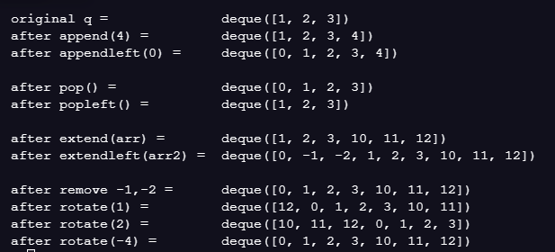

## Deque

- list 와 흡사
- FIFO 의 방식으로 작동
- 양방향 queue

## deque over list

deque 를 사용했을때 list 보다 더 빠르다

- O(1)
- list 는 O(n)

## Deque method

default 는 오른쪽 방향 (list와 동일)

- q.append : 기존 append 와 동일
- q.appendleft

- q.pop : 기존 pop 과 동일
- q.popleft

- q.extend : 주어진 array 배열을 순환하며 q의 오른쪽에 추가
- q.extendleft

- q.remove
- q.rotate
  - 양수 시계방향
  - 음수 반시계방향

ref:https://codingpractices.tistory.com/entry/Python%ED%8C%8C%EC%9D%B4%EC%8D%AC-%EC%99%9C-%EB%A6%AC%EC%8A%A4%ED%8A%B8%EB%8C%80%EC%8B%A0-%ED%81%90-%EB%8D%B0%ED%81%AC-deque-%EB%A5%BC-%EC%93%B8%EA%B9%8C